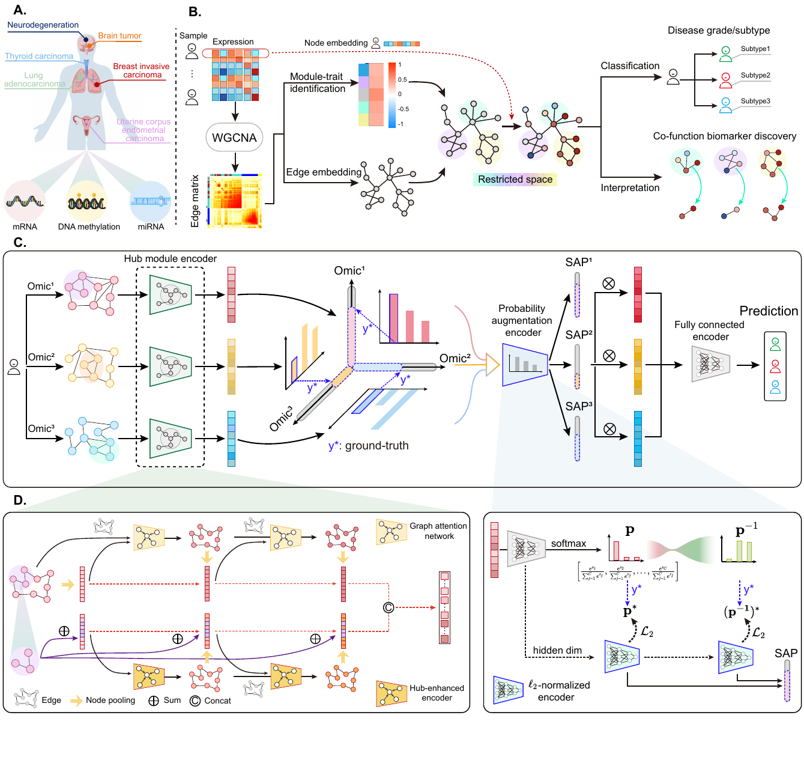
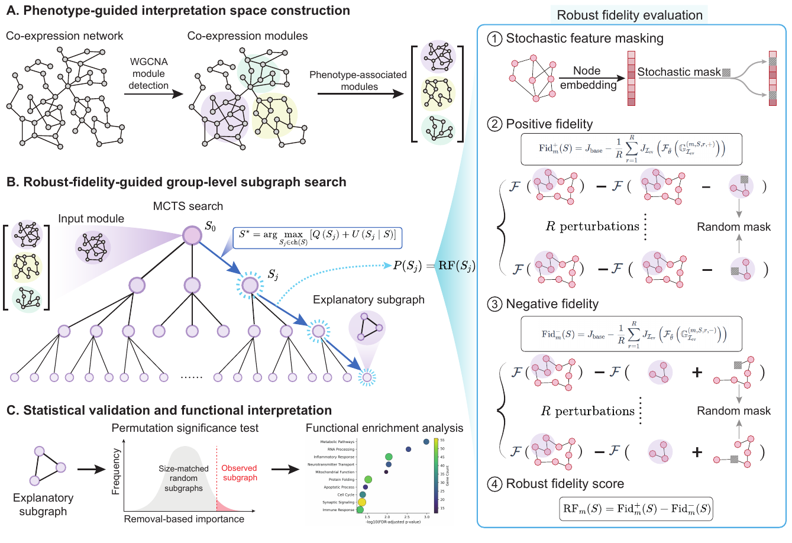

# MEP-GNN

Official implementation for **MEP-GNN: Modular Evidence-Preserving Graph Learning for Robust Multi-Omics Integration and Interpretation**.

## Overview

Multi-omics integration facilitates complex disease prediction, but existing methods often lack robustness to incomplete molecular observations and provide explanations whose reliability under perturbations remains unclear. MEP-GNN is a robust and interpretable graph learning framework for multi-omics disease prediction. It combines phenotype-guided modular graph representation learning, predictive reliability learning, and reliability-aware multi-omics integration.



*Figure 1. Overview of the MEP-GNN framework. Phenotype-associated molecular modules are identified from multi-omics profiles, used to guide modular graph representation learning, and integrated through predictive reliability learning for robust disease prediction and interpretation.*

## Abstract

We propose **Modular Evidence-Preserving Graph Neural Network (MEP-GNN)**, a robust and interpretable framework that integrates phenotype-associated molecular modules, sample-specific predictive reliability learning, and robust-fidelity-guided subgraph interpretation. MEP-GNN preserves disease-relevant structural information during graph representation learning, adaptively integrates heterogeneous omics according to transformed true-class probability-based reliability, and identifies group-level explanatory subgraphs that remain predictive under feature perturbations. Across six benchmark multi-omics datasets, MEP-GNN achieves superior or competitive predictive performance and improves robustness in both prediction and molecular interpretation under incomplete graph information.

## Our Contributions

- We formulate robust multi-omics learning as a joint problem of preserving phenotype-relevant molecular structure, estimating sample-specific omics reliability, and maintaining reliable molecular evidence under imperfect observations.
- We propose MEP-GNN, which combines phenotype-guided modular graph learning with transformed true-class probability-based reliability estimation for robust and adaptive multi-omics integration.
- We develop a robust-fidelity-guided subgraph interpretation framework that searches within phenotype-associated modules to identify perturbation-stable molecular structures, supported by statistical significance testing.



*Figure 2. Robust-fidelity-guided post-hoc interpretation. Phenotype-associated modules define a constrained explanation space, while MCTS and robust fidelity evaluation identify perturbation-stable explanatory subgraphs for statistical validation and functional interpretation.*

## Code Release

This repository currently provides the WGCNA preprocessing and predictive MEP-GNN training code. The complete code release, including the full interpretation pipeline and additional reproducibility materials, will be made available after the paper is accepted.

## Method Modules

| Paper module | Code location | Description |
| --- | --- | --- |
| Phenotype-guided modular evidence construction | `WGCNA/processing.R` | Uses WGCNA to build weighted co-expression adjacency matrices and identify phenotype-associated modules. |
| PMGA: phenotype-guided module-aware graph attention | `model/model.py` (`PMGAEncoder`, `TWGAT_3`) | Encodes each omics graph while enhancing selected phenotype-associated nodes. |
| PRL: predictive reliability learning | `model/model.py` (`PredictiveReliabilityLayer`, `Multi_TCP`) | Estimates direct and reciprocal true-class-probability reliability for each omics view. |
| MEP-GNN multi-omics classifier | `model/model.py` (`MEPGNN`, `Fusion`) | Fuses reliability-weighted omics representations for disease prediction. |
| Training and evaluation | `model/train.py` | Trains MEP-GNN and reports ACC, F1, AUC, sensitivity, and specificity. |

## Repository Structure

```text
MEP-GNN/
├── README.md
├── requirements.txt
├── assets/
│   ├── fig_framework.png
│   └── fig_interpretation.png
├── WGCNA/
│   └── processing.R
└── model/
    ├── model.py
    ├── train.py
    └── util.py
```

## Installation

Create a Python environment and install the required packages:

```bash
pip install -r requirements.txt
```

The WGCNA preprocessing script additionally requires R packages:

```r
install.packages(c("WGCNA", "flashClust", "openxlsx", "ggplot2"))
```

## Data Format

The training script expects three omics views, using the following file names under `data_dir`:

```text
data_dir/
├── 1_tr.csv
├── 2_tr.csv
├── 3_tr.csv
├── 1_te.csv
├── 2_te.csv
├── 3_te.csv
├── 1_tr_adj.csv
├── 2_tr_adj.csv
├── 3_tr_adj.csv
├── labels_tr.csv
├── labels_te.csv
├── 1_all_index.txt
├── 2_all_index.txt
└── 3_all_index.txt
```

Each omics CSV file should contain samples as rows and molecular features as columns. The label files should contain one class label per sample. The `*_all_index.txt` files contain selected phenotype-associated feature names, one per line, matching the columns in the corresponding omics CSV file.

## WGCNA Preprocessing

Generate a weighted adjacency matrix for an omics view:

```bash
Rscript WGCNA/processing.R /path/to/omics.csv /path/to/output_adj.csv /path/to/labels_tr.csv
```

Arguments:

1. input omics CSV file
2. output adjacency CSV file
3. training label CSV file

The same values can also be supplied through environment variables:

```bash
MEP_GNN_WGCNA_INPUT=/path/to/omics.csv \
MEP_GNN_WGCNA_OUTPUT_ADJ=/path/to/output_adj.csv \
MEP_GNN_WGCNA_LABELS=/path/to/labels_tr.csv \
Rscript WGCNA/processing.R
```

## Training

Run MEP-GNN training with configurable data, output, and device paths:

```bash
python model/train.py \
  --data_dir /path/to/data_dir \
  --output_dir /path/to/results \
  --index_dir "" \
  --device cuda:0
```

Important options:

| Option | Default | Description |
| --- | --- | --- |
| `--data_dir` | `/model/ROSMAP/data` | Directory containing omics features, adjacency matrices, labels, and selected indices. |
| `--output_dir` | `/model/ROSMAP/result/VCP` | Directory for result CSV files, TCP reliability traces, and saved model weights. |
| `--index_dir` | `""` | Optional subdirectory under `data_dir` for `*_all_index.txt` files. |
| `--device` | `cuda:1` if available, otherwise `cpu` | PyTorch device. |
| `--adj_Sample` | `0.1` | Threshold for binarizing weighted adjacency matrices. |
| `--batch_size_` | `30` | Batch size. |
| `--dropout` | `0.1` | Dropout rate. |
| `--alpha` | `0.2` | Negative slope for graph attention. |

## Citation

If you use this code, please cite:

```bibtex
@article{luo2026mepgnn,
  title = {MEP-GNN: Modular Evidence-Preserving Graph Learning for Robust Multi-Omics Integration and Interpretation},
  author = {Luo, Haoran and Li, Wei and Zheng, Lili and Fan, Zhoujie and Li, Sichen and Liang, Hong and Zhang, Chen Jason and Yao, Xiaohui and Cong, Shan},
  journal = {},
  year = {2026},
  note = {}
}
```
